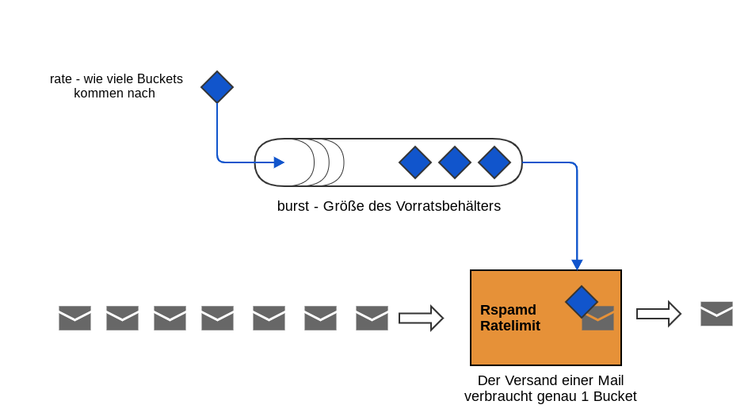
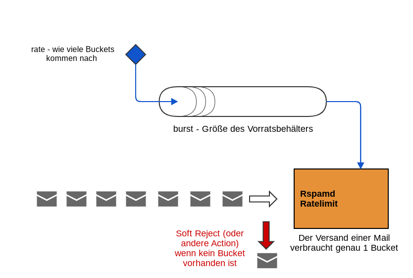
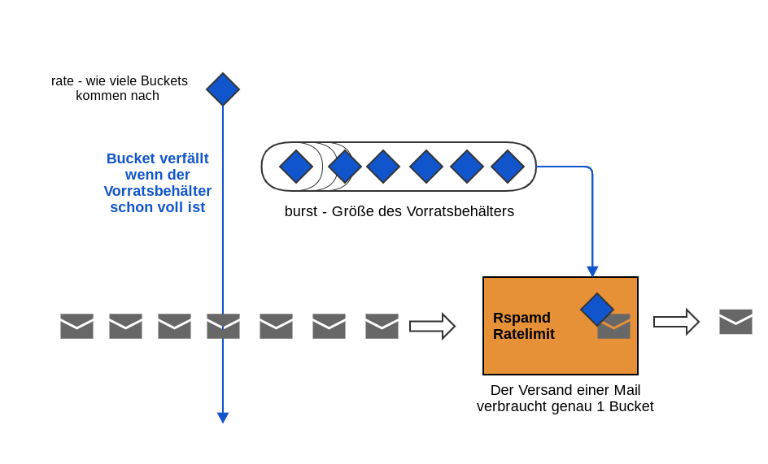
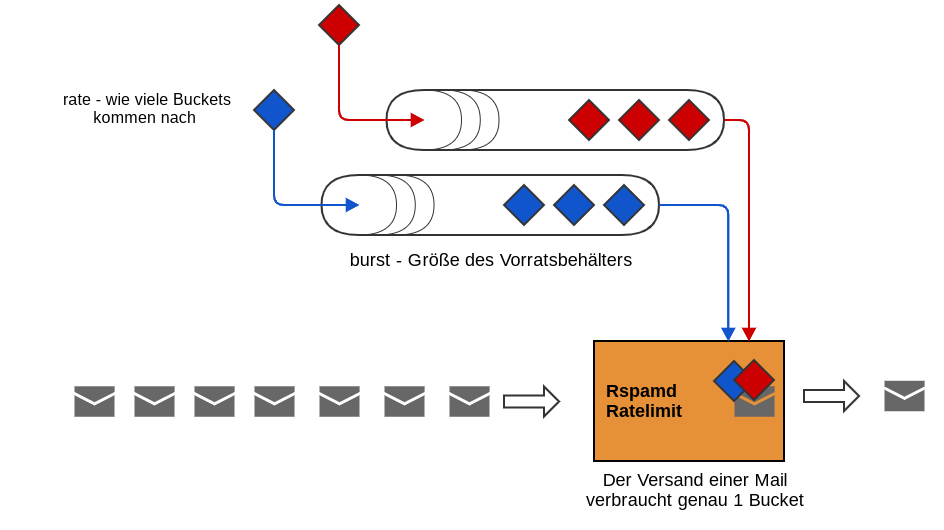

*****


# Sichere Mailcluster mit Rspamd und Spamhaus DQS

__Workshop auf der SLAC 2024__

Carsten Rosenberg <c.rosenberg@heinlein-support.de>
Manu Zurmühl <m.zurmuehl@heinlein-support.de>

_Enterprise grade mail-cluster with open-source? YES ;)_

[https://www.heinlein-support.de/blog/enterprise-mail-security-open-source](https://www.heinlein-support.de/blog/enterprise-mail-security-open-source)

*****

- [Sichere Mailcluster mit Rspamd und Spamhaus DQS](#sichere-mailcluster-mit-rspamd-und-spamhaus-dqs)
  - [Links zu den Configs](#links-zu-den-configs)
  - [Redundanter Postfix Cluster](#redundanter-postfix-cluster)
  - [Postfix Cluster #1](#postfix-cluster-1)
  - [Postfix Cluster #2](#postfix-cluster-2)
  - [Postfix Cluster #3](#postfix-cluster-3)
  - [Postfix Cluster #4](#postfix-cluster-4)
  - [Kapselung einzelner Dienste in eigene Systeme oder Container/CGroups](#kapselung-einzelner-dienste-in-eigene-systeme-oder-containercgroups)
  - [Realworld Sizing](#realworld-sizing)
  - [Rspamd Anbindung](#rspamd-anbindung)
  - [Quick Walkthrough Postfix und Rspamd Proxy Config](#quick-walkthrough-postfix-und-rspamd-proxy-config)
  - [MX Config](#mx-config)
  - [Hub Config](#hub-config)
  - [Mailout Config](#mailout-config)
  - [Quick Walkthrough Rspamd Proxy Config](#quick-walkthrough-rspamd-proxy-config)
  - [Rspamd - Symbole, Module, Plugins, Funktionen](#rspamd---symbole-module-plugins-funktionen)
  - [Rspamd Composites](#rspamd-composites)
  - [Rspamd - Actions](#rspamd---actions)
  - [Rspamd - Force Actions](#rspamd---force-actions)
  - [Warum Aktionen direkt in den Plugins (oft) nicht sinnvoll sind](#warum-aktionen-direkt-in-den-plugins-oft-nicht-sinnvoll-sind)
  - [Indikatoren sammeln und auswerten](#indikatoren-sammeln-und-auswerten)
  - [Scoring und Policies beim Rspamd](#scoring-und-policies-beim-rspamd)
  - [Rspamd Settings](#rspamd-settings)
  - [Rspamd - Composites + Force\_Actions + Gruppen + Settings](#rspamd---composites--force_actions--gruppen--settings)
    - [Beispiel Antivirus](#beispiel-antivirus)
    - [Beispiel Multimap + Settings](#beispiel-multimap--settings)
  - [Rspamd Selectors](#rspamd-selectors)
  - [Rspamd Selectors - eigene Selectors in Lua](#rspamd-selectors---eigene-selectors-in-lua)
  - [Multimap](#multimap)
  - [Ratelimit](#ratelimit)
  - [Reputation](#reputation)
  - [Spamhaus DQS](#spamhaus-dqs)
  - [DKIM](#dkim)
  - [ARC - Authenticated Received Chain](#arc---authenticated-received-chain)
  - [Bonus: Ratelimit Diagramme](#bonus-ratelimit-diagramme)
    - [Ratelimit mit leerem Vorratsbehälter (Burst)](#ratelimit-mit-leerem-vorratsbehälter-burst)
    - [Ratelimit mit vollem Vorratsbehälter (Burst)](#ratelimit-mit-vollem-vorratsbehälter-burst)
    - [Ratelimit bei mehreren Rules](#ratelimit-bei-mehreren-rules)

*****

## Links zu den Configs

+ Postfix MX: [https://github.com/HeinleinSupport/rspamd-slac-2024/tree/main/postfix-mx/etc/postfix](https://github.com/HeinleinSupport/rspamd-slac-2024/tree/main/postfix-mx/etc/postfix)
+ Postfix Hub: [https://github.com/HeinleinSupport/rspamd-slac-2024/tree/main/postfix-hub/etc/postfix](https://github.com/HeinleinSupport/rspamd-slac-2024/tree/main/postfix-hub/etc/postfix)
+ Postfix Mailout: [https://github.com/HeinleinSupport/rspamd-slac-2024/tree/main/postfix-mailout/etc/postfix](https://github.com/HeinleinSupport/rspamd-slac-2024/tree/main/postfix-mailout/etc/postfix)
+ Rspamd Proxy: [https://github.com/HeinleinSupport/rspamd-slac-2024/tree/main/rspamd-proxy/etc/rspamd](https://github.com/HeinleinSupport/rspamd-slac-2024/tree/main/rspamd-proxy/etc/rspamd)
+ Rspamd Worker: [https://github.com/HeinleinSupport/rspamd-slac-2024/tree/main/rspamd-worker/etc/rspamd/local.d](https://github.com/HeinleinSupport/rspamd-slac-2024/tree/main/rspamd-worker/etc/rspamd/local.d)

*****

## Redundanter Postfix Cluster

- Wir trennen bei einer Postfix Infrastruktur gern die Systeme mit Internet-Kommunikation und internen Verbindungen
- externe Systeme sollten im Idealfall keinen Zugriff interne Systeme haben (bzw. nur zum internen Postfix)
- interne Mails laufen nicht über Systeme mit Verbindung zum Internet
- MX Server (eingehend) und Mailout (ausgehend) stehen also in einer DMZ
- HUB (interner Mailverteiler) steht im internen Netzwerk und kommuniziert auch mit MX und Mailout

*****

## Postfix Cluster #1


*****

## Postfix Cluster #2


*****

## Postfix Cluster #3


*****

## Postfix Cluster #4


*****

## Kapselung einzelner Dienste in eigene Systeme oder Container/CGroups

- Redis reagiert empfindlich wenn der Arbeitsspeicher im System ausgeht
- File Analyse-Tools wie Anti-Viren Systeme oder VBA/PDF-Analysen können bei der Analyse abstürzen
- Darum sperren wir diese Tools gern in extra Systeme, Container oder mit anderen Mechanismen ein

*****

## Realworld Sizing

- Wir benötigen nicht zwingend __xx__ VMs für einen wirkungsvollen Cluster
- die Ideen hinter der Segmentierung/Aufteilung lassen sich auch lassen sich auch mit 2 Systemen hochverfügbar umsetzen
- es geht vor allem darum mögliche Sicherheitsprobleme zu minimieren und einen effektiven redundanten Cluster aufzubauen

*****

## Rspamd Anbindung

- Um Single Points of Failure zu vermeiden installieren wir den Rspamd Proxy direkt auf dem Postfix System
- Der Proxy bekommt eine Liste von Rspamd Backends, die lastverteilend angesprochen werden
- Vorteil: Redundanz und Ausfallsicherheit
- Jeder Postfix übergibt via `milter_macro_daemon_name` ein Keyword für seine Aufgabe im Cluster
  - z.B. _incoming_

*****

## Quick Walkthrough Postfix und Rspamd Proxy Config

- Postfix kümmert sich nur noch um Routing, statische Adressumschreibung und einige RFC Prüfungen
- TLS sollte forciert werden - ja auch wenn es gegen die RFCs ist ;)
- Access Maps sind definiert aber leer und nur für den Notfall gedacht
- nur kleine Unterschiede bei MX, Hub (interne Router), Mailout Server
- Datenbank Anbindung am besten nur auf den internen Hubs
- Nutzung von ASCII Listen (texthash) als Lookup Tables
  - heutzutage zu wenig Daten für eine indizierte Datenbank
  - postmap kann nicht vergessen werden ;)

*****

## MX Config

- Configs: relay_domains, verify, ggf. TLS Ausnahmen

```conf
smtpd_tls_security_level = may
smtp_tls_security_level = encrypt

# Postfix Lookup Tables / Maps / Databases
relay_domains = texthash:/etc/postfix/maps.d/relay_domains.list
transport_maps = texthash:/etc/postfix/maps.d/transport.list, $relay_domains
smtp_tls_policy_maps = texthash:/etc/postfix/maps.d/tls_policy.list

# Postfix Restrictions
smtpd_recipient_restrictions = 
# Postmaster whitelisten!
  check_recipient_access inline:{
    {postmaster@=permit_mynetworks,permit_sasl_authenticated,reject_unauth_destination,permit}
    {abuse@=permit_mynetworks,permit_sasl_authenticated,reject_unauth_destination,permit}
    },
# Empfaenger whitelisten?
  check_recipient_access texthash:/etc/postfix/maps.d/access_recipient.list,
# Hosts und Absender blacklisten?
  check_client_access cidr:/etc/postfix/maps.d/access_client.cidr,
  check_sender_access texthash:/etc/postfix/maps.d/access_sender.list,


# TLS forcieren - aber Ausnahmen erlauben
  check_sender_access pcre:/etc/postfix/maps.d/access_sender_tls_exclude.pcre,


# Keine unsauberen Mails annehmen!
  reject_non_fqdn_sender,
  reject_non_fqdn_recipient,
  reject_unknown_sender_domain,
  reject_unknown_recipient_domain,
# Unsere Kinderchens erlauben!
  permit_mynetworks,
# Alles andere Relaying verbieten!
  reject_unauth_destination,
# Dynamische Empfängervalidierung
  reject_unverified_recipient,
# Was jetzt noch ist darf durch!
  permit
```

- /etc/postfix/maps.d/access_sender_tls_exclude.pcre

```conf
# exclude @mailexample.com from the TLS enforcement
/.*@mailexample.de/i DUNNO

/.*/  reject_plaintext_session
```

*****

## Hub Config

- Configs: relay_domains, transport, mynetworks, virtual, verify, ggf. TLS Ausnahmen

```conf
smtpd_tls_security_level = encrypt
smtp_tls_security_level = encrypt

# Postfix Lookup Tables / Maps / Databases
relay_domains = texthash:/etc/postfix/maps.d/relay_domains.list
transport_maps = texthash:/etc/postfix/maps.d/transport.list, $relay_domains
smtp_tls_policy_maps = texthash:/etc/postfix/maps.d/tls_policy.list
lmtp_tls_policy_maps = texthash:/etc/postfix/maps.d/tls_policy.list
virtual_alias_maps = texthash:/etc/postfix/maps.d/virtual_alias.list

# Postfix Restrictions
smtpd_recipient_restrictions = 
# Postmaster whitelisten!
  check_recipient_access inline:{
    {postmaster@=permit_mynetworks,permit_sasl_authenticated,reject_unauth_destination,permit}
    {abuse@=permit_mynetworks,permit_sasl_authenticated,reject_unauth_destination,permit}
    },
# Empfaenger whitelisten?
  check_recipient_access texthash:/etc/postfix/maps.d/access_recipient.list,
# Hosts und Absender blacklisten?
  check_client_access cidr:/etc/postfix/maps.d/access_client.cidr,
  check_sender_access texthash:/etc/postfix/maps.d/access_sender.list,
# Keine unsauberen Mails annehmen!
  reject_non_fqdn_sender,
  reject_non_fqdn_recipient,
  reject_unknown_sender_domain,
  reject_unknown_recipient_domain,
# Unsere Kinderchens erlauben!
  permit_sasl_authenticated,
  permit_mynetworks,
# Alles andere Relaying verbieten!
  reject_unauth_destination,
# Dynamische Empfängervalidierung
  reject_unverified_recipient,
# Was jetzt noch ist darf durch!
  permit
```

*****

## Mailout Config

- Configs: transport, mynetworks, ggf. TLS Ausnahmen und Verschärfung (Dane)

```conf
smtpd_tls_security_level = encrypt
smtp_tls_security_level = encrypt

# Postfix Lookup Tables / Maps / Databases
transport_maps = texthash:/etc/postfix/maps.d/transport.list
smtp_tls_policy_maps = texthash:/etc/postfix/maps.d/tls_policy.list

# Postfix Restrictions
smtpd_recipient_restrictions = 
# Postmaster whitelisten!
  check_recipient_access inline:{
    {postmaster@=permit_mynetworks,permit_sasl_authenticated,reject_unauth_destination,permit}
    {abuse@=permit_mynetworks,permit_sasl_authenticated,reject_unauth_destination,permit}
    },
# Empfaenger whitelisten?
  check_recipient_access texthash:/etc/postfix/maps.d/access_recipient.list,
# Hosts und Absender blacklisten?
  check_client_access cidr:/etc/postfix/maps.d/access_client.cidr,
  check_sender_access texthash:/etc/postfix/maps.d/access_sender.list,
# Unsere Kinderchens erlauben!
  permit_mynetworks,
# Was jetzt noch ist darf durch!
  permit

```

*****

## Quick Walkthrough Rspamd Proxy Config

- Rspamd Proxy ist kein eigenständiges Paket
- es wird der komplette Rspamd installiert
- wir benötigen aber nur ein paar Anpassungen für Actions, Logging, Timeouts und die Rspamd Backend Config
- alles andere wird in der `rspamd.conf.local.override` abgeschaltet

/etc/rspamd/rspamd.conf.local.override:

```conf
modules {
  path = "/var/lib/rspamd/modules";
  fallback_path = "/var/lib/rspamd/modules"; # Legacy path
}
lua = "/var/lib/rspamd/modules/nil.lua";

antivirus { enabled=false; }
arc { enabled=false; }
asn { enabled=false; }
aws_s3 { enabled=false; }

...

```

/etc/rspamd/local.d/worker-proxy.inc:

```conf
bind_socket = "127.0.0.1:11332";
bind_socket = "[::1]:11332";

upstream "scan" {
  default = yes;
  hosts = "round-robin:10.0.3.146:11333:1,10.0.3.147:11333:1";
  key = "j4zcyxp84q47n8quhnmshbgaa5esjqu451hipxam49g6fhm5kpgy"; 
  compression = yes;
}

```

*****

## Rspamd - Symbole, Module, Plugins, Funktionen

- Rspamd denkt in Symbolen
- Symbole im Rspamd sind wie Objekte, die auszuführende Funktionen haben, Konfigurationen, Beschreibungen, Punkte haben können
- Symbole lassen sich zur Laufzeit an- und abschalten, logisch verknüpfen oder für forcierte Aktionen nutzen
- Symbole können in der Main-Phase (nicht pre-filter/post-filter) Dependencies auf andere Symbole haben
  - z.B. DMARC wird erst ausgeführt wenn SPF und DKIM geprüft sind
- Symbole können einer oder mehreren Gruppen zugeordnet werden


*****

## Rspamd Composites

- wirken wie die Meta Rules in Spamassassin und können noch einiges mehr
- Matching erfolgt als logische Verknüfung auf aktivierte Symbole oder Gruppen
  - `expression = "INCOMING & BAD_SUBJECT";`
- Wenn eine logische Verknüpfung `true` ist kann  
  - neues Symbol und Punkte hinzugefügt werden
  - gematchte Symbole entfernen oder deren Score

*****

## Rspamd - Actions

- Rspamd kennt verschiedene Aktionen, die bei der Überschreitung der Summe aller Symbole ausgelöst werden
  - no action
  - greylist (soft reject)
  - add header (hier geht es nicht direkt um Header)
  - rewrite subject
  - reject
- dazu können je nach MTA auch eigene Aktionen definiert werden (Postfix/Milter z.B. discard, quarantine)

[https://rspamd.com/doc/configuration/metrics.html](https://rspamd.com/doc/configuration/metrics.html)

*****

## Rspamd - Force Actions

- in den Force Actions lassen mit logischen Verknüpfungen (expressions) von Symbolen auch Aktionen unabhängig von Schwellwerten forcieren
  - `expression = "CLAMAV_VIRUS & !WHITELIST_ANTIVIRUS";`
- alle in actions definierte Aktionen nutzbar
  - Achtung: ein `reject = null;` schaltet die Aktion reject ganz ab
- direkte Aktionen lassen sich auch direkt in verschiedenen Plugins auslösen
  - Antivirus
  - Multimap
  - DMARC
  - Ratelimit
  - Spamtrap

[https://rspamd.com/doc/modules/force_actions.html](https://rspamd.com/doc/modules/force_actions.html)

*****

## Warum Aktionen direkt in den Plugins (oft) nicht sinnvoll sind

- Ausnahmen von den Rejects (Whitelisting) sind nur mit vordefinierten Ausnahmen im Plugin möglich oder gar nicht umsetzbar
- Frühe Rejects lösen einen Passthrough aus, so dass andere Prüfungen abgebrochen werden
  - eindeutige Spam Mails werden ggf. nicht gelernt
- Oft werden die Rejects in den Plugins eher pauschal ausgeführt
  - Antivirus z.B. verschlüsselte Mails oder Fehlercodes
  - Ratelimit alle Limits führen zu einem Soft Reject

*****

## Indikatoren sammeln und auswerten

- Wir empfehlen Rspamd viele Indikatoren sammeln zu lassen und diese am Ende des Scan auszuwerten
  - Eine Virus Mail wird vielleicht auch als Spam erkannt und dann auch gelernt
- Dafür werden Composites und Force Actions intensiv genutzt
- Ausnahmen lassen sich auf einfache Weise umsetzen
- Es kann eingehender, ausgehender und interner Traffic einfach unterschieden werden
- Viren lassen sich z.B. in Spam (zum Lernen) und Malware (einfach ablehnen) kategorisieren
- Ratelimit Rules können einzeln bewertet werden
  - Ablehnung bei bestimmten Rules
  - Info an den Admin bei anderen Limits
- solange es keine sehr komplexen Multimaps sind verzichten wir auf Optionen _Conditional Maps_ oder _Combined maps_

*****

## Scoring und Policies beim Rspamd

- oft sehen wir, dass unerwünsche Anhänge oder Absender mit einem hohen Score zum ablehnen gebracht werden
- hohe Scores triggern aber auch immer die Lern-Mechanismen des Rspamd
  - Bayes, Fuzzy, Reputation, Neural Network, (Ratelimit)
- _Das möchtet ihr bei der Mail mit .exe von euren Kollegen bestimmt nicht_
  - wird spätestens lustig wenn eure Signatur als Spam erkannt wird ;)
- Ablehnung aus Policy Gründen: Force Actions und höchstens kleiner Score
- Ablehnung als SPAM: hoher Score (aber bitte mit vielen Indikatoren)
- Gruppen können als Absicherung in ihrem maximalen Score begrenzt werden
  - z.B. IP ist in fast jeder RBL gelistet
- Bei Policy und Spam zieht auch die Force Action, aber die Mail wird trotzdem angelernt

Beispiel Multimaps:

- SENDER_DOMAIN_BLOCKLIST -> reject via force_actions
- SENDER_DOMAIN_SPAM -> 8.0 Punkte

*****

## Rspamd Settings

- Mit dem Settings Plugin im Rspamd lässt sich ein Scan-Profil erstellen, dass abweichende Schwellwerte hat, bestimmte Funktionen deaktiviert oder explizit aktiviert
- Oder einfach ein weiteres Symbol als Indikator für Composites oder Force Actions bereits stellt
- die Settings-Profile können statisch in einer Datei liegen, von einem Webserver abgerufen werden, im Redis hinterlegt sein oder von einer HTTP API abgerufen werden
- Settings Profile haben ein Matching und eine Priorität sowie eine Sektion für Anpassungen und für zusätzliche Symbole
- Wir definieren Default Symbole nach ihrer Stelle in der Infrastruktur
  - _incoming_
  - _outgoing_
  - _internal_
- dazu kommen oft extra Profile für bestimmte Systeme oder um zusätzliche Ausnahmen zu ermöglichen
  - z.B. auf dem Hub - wenn die Mail vom MX kommt

```conf
# Default IN - no DKIM sign
INCOMING_DEFAULT {
  id = "INCOMING_DEFAULT";
  priority = low;
 
  request_header = {
    # milter_macro_daemon_name in postfix
    "MTA-Name" = "^incoming_default$";
  }
  apply {
    actions {
      # just an example
      # "rewrite subject" = 13; # Please note the space, NOT an underscore
    }
    symbols_disabled = [
      "DKIM_SIGNED",
    ];
  }
  symbols [
      "INCOMING_DEFAULT",
      "INCOMING"
  ]
}


# Default OUT full + dkim sign
OUTGOING_DEFAULT {
  id = "OUTGOING_DEFAULT";
  priority = low;
  request_header = {
    # milter_macro_daemon_name in postfix
    "MTA-Name" = "^outgoing_default$";
  }
  apply {
    groups_disabled = [
      "dmarc",
    ];
  }
  symbols [
      "OUTGOING_DEFAULT",
      "OUTGOING"
  ]
}
```

[https://rspamd.com/doc/configuration/settings.html](https://rspamd.com/doc/configuration/settings.html)

*****

## Rspamd - Composites + Force_Actions + Gruppen + Settings

- Wie kommen wir von einzelnen Indikatoren nun zur Ablehnung einer Mail?

### Beispiel Antivirus

- Indikator: `CLAMAV_U_PORCUPINE_MALWARE(8.00){Porcupine.Malware.58486.UNOFFICIAL;}`
- Anstelle des Default Symbols CLAMAV haben wir über die Patterns ein eigenes Symbol für diese Signatur erstellt

/etc/rspamd/local.d/antivirus.conf

```conf
clamav {
  ...
  symbol = "CLAMAV"

  patterns {
    ...
    CLAMAV_U_PORCUPINE_MALWARE = '/^Porcupine\.Malware/i';
  }
}
```

- Dieses neue Symbol ließe sich jetzt direkt verwenden, aber das ist nicht managebar
- Also nutzen wir Gruppen

/etc/rspamd/local.d/antivirus_group.conf

```conf
symbols = {
  "CLAMAV_U_PORCUPINE_MALWARE" {
    description = "ClamAV U ^Porcupine.Malware found";
    weight: 8;
    groups: ["clamav_unofficial", "clamav_u_porcupine", "av_virus_reject", "clamav_u_reject"];
    one_shot: true;
  }
}
```

- Die Gruppe `av_virus_reject` läßt sich nun für den Reject nutzen
- Ein Score von 8 zeigt außerdem, dass wir diese Signatur in Spam Mails sehen
- Matchen der Gruppe in Composites

/etc/rspamd/local.d/composites.conf

```conf
GROUP_VIRUS_REJECT {
  expression = "g:av_virus_reject";
  score = 0.0;
  policy = "leave";
  description = "Found a VIRUS_REJECT symbol";
}
```

- Ablehnung der Mail dann in den Force Actions

/etc/rspamd/local.d/force_actions.conf

```conf
rules {
  VIRUS_REJECT {
    action = "reject";
    expression = "GROUP_VIRUS_REJECT";
    message = "REJECT - virus found (support-id: ${queueid}-${uid.substring(1, 6)})";
    require_action = ["no action", "greylist", "reject", "add header", "soft reject", "rewrite subject", "discard", "quarantine"];
  }
}
```

[https://rspamd.com/doc/modules/antivirus.html](https://rspamd.com/doc/modules/antivirus.html)

*****

### Beispiel Multimap + Settings

- Ablehnung von bestimmten Anhängen bei eingehenden Mails und wenn der Empfänger nicht auf der Welcomelist steht
- Indikator: `BANNED_EXTENSIONS(0.00){exe;}`

/etc/rspamd/local.d/multimap.conf

```conf
BANNED_EXTENSIONS {
  # Map banned_extensions.map Example:
  # exe
  # scr

  type = "filename";
  filter = "extension";
  map = "file://$LOCAL_CONFDIR/local.d/maps.d/banned_extensions.map";
  symbol = "BANNED_EXTENSIONS";
  score = 1.0;
  message = "A restricted file type was found";
  #skip_archives = true;
}
```

- Wir brauchen hier keine Composites, da wir nicht auf Gruppen matchen
- Ablehnung der Mail in den Force Actions
- die beiden anderen Symbole kommen aus den Settings (INCOMING) und einer anderen Multimap (WL_RCPT_BANNED_EXTENSIONS)

```conf
rules {
  BANNED_EXTENSIONS {
    action = "reject";
    expression = "INCOMING & BANNED_EXTENSIONS & !WL_RCPT_BANNED_EXTENSIONS";
    message = "REJECT - policy violation - attachment type is forbidden (support-id: ${queueid}-${uid.substring(1, 6)})";

  }
}
```

[https://rspamd.com/doc/configuration/composites.html](https://rspamd.com/doc/configuration/composites.html)

*****

## Rspamd Selectors

- Selectors sind kleine Funktionen die sich wie Pipes verketten lassen
- Damit ist es möglich fast jeden Wert aus einer Mail oder den Scan-Daten abzurufen und sogar noch zu modifizieren
- Oft können Selectors in den Modulen neben statisch definierten Werten (IP, from) verwendet werden
- Eigene Selectors können in Lua geschrieben werden
- Default Module mit Selector Unterstützung
  - multimap
  - ratelimit
  - reputation
  - rbl
  - force_actions (reject message)

Beispiele:

- Lowercased Subject als HEX und auf die ersten 16 Zeichen reduziert

```lua
header('Subject').lower.digest('hex').substring(1, 16)
```

- Ein Header Wert verknüpft mit der SMTP-From Domain
- `id` würde den Header mit einem String ersetzen `.id('test')`
- Effektiv: gibt die SMTP-From Domain zurück wenn `X-SG-EID` existiert

```lua
header("X-SG-EID").id;from("smtp","orig"):domain.get_tld'
```

- SHA256 Hashes aller Attachments

```lua
attachments(hex,sha256)
```

- Matching auf den Wochentag verknüpft mit dem Auth-User
- gibt '_usernamework_' oder gar nichts zurück

```lua
user.lower;time('connect', '!%w').in(1, 2, 3, 4, 5).id('work')
```

- Werte aus Symbolen (Options) - hier BITCOIN_ADDR

```lua
symbol('BITCOIN_ADDR'):options.first
```

[https://rspamd.com/doc/configuration/selectors.html](https://rspamd.com/doc/configuration/selectors.html)
*****

## Rspamd Selectors - eigene Selectors in Lua

- Source IP - aber nur wenn es eine IPv4 Adresse ist
- Ginge bestimmt auch mit vordefinierten Selectors und regexp filter ;)

```lua
lua_selectors.register_extractor(rspamd_config, "ipv4", {
  get_value = function(task, args)
    local ip = task:get_ip()
    if ip and ip:is_valid() and ip:get_version() == 4 then return ip,'userdata' end
    return nil
  end,
  description = 'Get only ipv4 addresses'
})
```

[https://rspamd.com/doc/lua/lua_selectors.html](https://rspamd.com/doc/lua/lua_selectors.html)
*****

## Multimap

- Aktivierung eines Symbols wenn ein Abfragewert gegen eine Map matcht
- Maps können dabei immer lokale Dateien, Dateien auf Webservern, Redis Daten oder HTTP-API sein
- Vordefinierte Abfragewerte (IP, From etc) + Filter oder Selectors
  - Man kann quasi jeden Wert auf der Mail oder dem Scan gegen eine Liste matchen lassen
- Nutzen wir meist als Indikator für Policies
  - Blocklisten
  - Fraud Detection unserer Domains von außen
  - Extensions
- Selten für das Matching auf SPAM
- Prefilter (+ reject), Conditional Maps, Combined maps nutzen wir nicht

__Beispiel SENDER_IP_BLOCKLIST:__

- reiner Indikator (für die Force Actions) ohne Score
- Reject aus Policy Gründen

```conf
SENDER_IP_BLOCKLIST {
  # Map sender_ip_blocklist.map Example:
  # 10.0.0.1
  # 10.2.0.0/16

  type = "ip";
  map = "file://$LOCAL_CONFDIR/local.d/maps.d/sender_ip_blocklist.map";
}
```

__Beispiel SENDER_DOMAIN_SPAMLIST:__

- Spam Indikator - wir wollen den Score nach oben treiben

```conf
SENDER_DOMAIN_SPAMLIST {
  # Map sender_domain_spamlist.map Example:
  # spamdomain.br
  # nextspammer.shop

  type = "from";
  filter = "email:domain";
  map = "file://$LOCAL_CONFDIR/local.d/maps.d/sender_domain_spamlist.map";
  score = 8.0;
}
```

- Matching des Mime-Content-Types auf S/Mime / PGP Content mit Custom-Selector
- Wird dann z.B. für das Umrouten der Mail genutzt

```conf
ENCRYPTED_MIME_PART_CT {
  # Map encrypted_mime_part_ct.map Example:
  # /multipart\/signed;.*/i
  # /application\/pkcs7-mime;.*/i
  # /application\/pgp-keys;.*/i

  type = "selector";
  selector = "attachments_ct.uniq";
  map = "file://$LOCAL_CONFDIR/local.d/maps.d/encrypted_mime_part_ct.map";
  symbol = "ENCRYPTED_MIME_PART_CT";
  regexp = true;
}
```

[https://rspamd.com/doc/modules/multimap.html](https://rspamd.com/doc/modules/multimap.html)

*****

## Ratelimit

- Ratelimit funktioniert nach dem Leaky Bucket Verfahren
- Es wird also nicht 1:1 gezählt sondern auch mit einem Vorratsbehälter (Burst) gearbeitet
- Das macht es manchmal schwieriger nachzuvollziehen wann ein Ratelimit erreicht ist
- Auch hier die übliche Vorgehensweise:
  - Wir bauen uns beliebige Limits aber ohne Aktion nur als Indikator
  - Das matchen wir über Gruppen (groups.conf) und Force Actions
- Mit Selectors kann man Limits auf ALLES bauen ;)
- Wir nutzen wegen schlechter Erfahrungen keine `ham_factor_rate` und `ham_factor_burst` mehr

```conf
rates {
  ip = {
    # sender IP address
    selector = 'ip';
    # You can define more than one bucket, however, you need to use array syntax only
      bucket = [
        {
          symbol = RATELIMIT_IP_MINUTE;
          burst = 10;
          rate = "20 / 1min";
        },
        {
          symbol = RATELIMIT_IP_HOUR;
          burst = 100;
          rate = "1000 / 1h";
        }
      ]
  }
}

# rate / burst adjustments based on spam result
# we do not change the rates / burst on ham results anymore
max_rate_mult = 10;
max_bucket_mult = 20;

# HAM / SPAM Multiplikator für Rate
ham_factor_rate = "1.00"
spam_factor_rate = "0.96"
# HAM / SPAM Multiplikator für Burst
ham_factor_burst = "1.00"
spam_factor_burst = "0.92"

```

[https://rspamd.com/doc/modules/ratelimit.html](https://rspamd.com/doc/modules/ratelimit.html)
*****

## Reputation

- Reputation kalkuliert die Durchschnittspunkte der vergangenen Mail-Scans für einen Wert
- Daraus leitet sich dann der Score für Reputation ab
- Lernt selbstständig und ist bei kleineren Scoren ein sehr schöner automatischer zusätzlicher Indikator
  - Scores in der groups.conf vergeben
- Mit Selectors baut kann mensch Reputationen auf ALLES bauen (z.B. X-Mailer)

```conf

rules {

  ip_reputation = {
    selector "ip" {
    }
    backend "redis" {
    }
    symbol = "IP_REPUTATION";
  }

  sender_replyto_reputation =  {
    selector "generic" {
      selector = "header('Reply-To')";
    }
    backend "redis" {
    }
    symbol = "SENDER_REPLYTO_REPUTATION";
  }

  bitcoin_reputation =  {
    selector "generic" {
      selector = "symbol('BITCOIN_ADDR'):options.first";
    }
    backend "redis" {
    }
    symbol = "BITCOIN_REPUTATION";
  }

}

```

[https://rspamd.com/doc/modules/reputation.html](https://rspamd.com/doc/modules/reputation.html)
*****

## Spamhaus DQS

- Rspamd bringt im Default Configs für Spamhaus ZEN und DBL mit
- mit dem (kommerziellen) DQS von Spamhaus kommen diese Datenbanken hinzu
  - ZRD - neue Domains
  - AuthBL - IPs die mit Brute-Force aufgefallen sind
  - HBL - Hash Blocklist - File, E-mail, Crypto-Wallets, komplette URLs
  - Subdomains bei DBL
- Das muss im Rspamd extra konfiguriert werden
- Spamhaus Configs dafür - [https://github.com/spamhaus/rspamd-dqs](https://github.com/spamhaus/rspamd-dqs)
  - Wir finden die Umsetzung nicht so schön gelöst und haben das etwas umgebaut ;)
  - Hier wieder: Umsetzung der komplexeren Anteile als Selector!
  - Die benötigten Selectors und Config findet ihr bei der Rspamd Config

*****

## DKIM

- Bei DKIM nutzen wir sehr oft gar keine Domain spezifischen Keys
- Rspamd kennt einen Fallback, der auf einen generischen Key zurück geht
- Außerdem kann Rspamd vor der Signierung prüfen ob der richtige Public Key für eine Domain im DNS hinterlegt ist
  - Auch bei dutzenden Domains kann rein über das DNS gesteuert werden ob signiert wird oder nicht
- Im DNS muss gar kein richtiger TXT Eintrag gemacht werden.
- Es wird ein zentraler Eintrag gesetzt, der von allen aktiven DKIM Domains dann nur "referenziert" wird.
- Erstellt zur Sicherheit am Besten auch gleich einen Backup-Key und entsprechende DNS Einstellungen

__Beispiel:__

- generischer DNS Eintrag (kein korrekter DKIM DNS Pfad)

```dns
DKIM001._domainkey IN TXT ( "v=DKIM1; k=ed25519;" 
  "p=jq9RXxO589TEKlnrylc3eFq5x58xBQjRCl/aYdbwQME="
)

```

- CNAME

```dns
DKIM001._domainkey.mailexample.de CNAME DKIM001.dkim.mailexample.de
DKIM002._domainkey.mailexample.de CNAME DKIM002.dkim.mailexample.de

DKIM001._domainkey.example.com CNAME DKIM001.dkim.mailexample.de
DKIM002._domainkey.example.com CNAME DKIM002.dkim.mailexample.de

```

- dkim_signing.conf

```conf
# Default selector to use
selector = "dkim001";

# If true, envelope/header domain mismatch is ignored
allow_hdrfrom_mismatch = true;
allow_hdrfrom_multiple = true;
allow_username_mismatch = true;

sign_authenticated = true;
sign_local = true;
sign_networks = "/etc/rspamd/local.d/maps.d/sign_networks.map"; # or url

use_domain = "header";

# Whether to fallback to global config
try_fallback = true;

# Whether to normalise domains to eSLD
use_esld = false;

# If `true` get pubkey from DNS record and check if it matches private key
check_pubkey = true;

# Set to `false` if you want to skip signing if publick and private keys mismatches
allow_pubkey_mismatch = false;

```

[https://rspamd.com/doc/modules/dkim_signing.html](https://rspamd.com/doc/modules/dkim_signing.html)

*****

## ARC - Authenticated Received Chain

- die Idee kaputtes DMARC, DKIM, SPF bei Weiterleitungen zu reparieren bzw abzuschwächen
- und jeden MTA (Hop) auf dem Weg der Zustellung mittels einer Signatur verifizieren zu können
- jeder MTA bezieht sich auf die Einträge der vorherigen MTA's
- Instanznummer (i) bezeichnet die Reihenfolge der ARC Header

- Jeder MTA hängt analog zu DKIM seine eigene extra Signatur mit seinem eigenen Schlüssel an

```email
ARC-Message-Signature: i=1; a=rsa-sha256; c=relaxed/relaxed; d=ncxs.de;
  s=arc; t=1662545894; h=from:from:reply-to:reply-to:subject:subject:date:date:
  message-id:message-id:to:to:cc:mime-version:mime-version:
  content-type:content-type:dkim-signature;
  bh=blG69kNZ8LiIVEQ+94j5HVyLQhIb2l6zTuMg9kGt+S0=;
  b=zfTNg0LOiq6zf+zGRAryC5qd2UGrBMgVDtE5E6NsyYuKkGcflJ+T5nhOYPYcCa4BBY/zB5
  d0napA3sZ4NthPQmfdvERoctIh1GcJyHaVlkShMuD1F8AHyR24d43wvQvxKLqHVfD11jtv
  JLrFDXXbWG21UjQOeHaijzdjG3xjOdVs06tGJhL9pRckLdvpk/SdOS94JoBLNuMouiXXbJ
  mx60jYGNhKSZt0rTcsDzTIhNBTssXZaPzwcjx6X/TN3spYMawx6cE73lY0P/7wMTuUwj16
  4DZnjIMq5CEoerWOnge0e/Hv3Jvgf3p6gCD7Ap8h6yxRwXg49J+Fj/KGAP9KDg==
```

- der aktuelle Status von SPF, DKIM und DMARC wird dokumentiert (kann zwischendrin kaputt gegangen sein)

```email
ARC-Authentication-Results: i=1;
  smtpd-in;
  dkim=pass header.d=amazon.de header.s=llktbq2gwxn3x3xrq5ljspgjk2nc5ajv header.b=ggSqgGHR;
  dkim=pass header.d=amazonses.com header.s=ihchhvubuqgjsxyuhssfvqohv7z3u4hn header.b=GsVmLgqr;
  dmarc=pass (policy=quarantine) header.from=amazon.de;
  spf=pass (smtpd-in: domain of 20220907101812f8fb95bae5cc4c4bb24dc960fe80p0eu-C1N7BPP2IWLHN@bounces.amazon.de 
    designates 54.240.1.68 as permitted sender) 
    smtp mailfrom=20220907101812f8fb95bae5cc4c4bb24dc960fe80p0eu-C1N7BPP2IWLHN@bounces.amazon.de
```

- ein extra Seal signiert nur die vorherigen ARC Header und deren Zustand (valid/invalid)

```email
ARC-Seal: i=1; s=arc; d=ncxs.de; t=1662545894; a=rsa-sha256; cv=none;
  b=VrzjYe+zk8xlADwh1P1qkmRDf+UUBLecv9pAfT79RMPvwm//wcTtqiJYUPz5ObGLtRkFwB
  HWLR1JzSOk2s0mlKX1rsUlO3AdysAWJ5OdEMI4UCCt0E7iDrX+kmzSJB/sR93lMxnnI28C
  5rUNn34vde+S188lMzdfT6Z0m18nMn4piVJWNceo0o+dvOlXkcr5vKarrB4Lrs8u9Hvgd3
  4knVXRxGhgRMYOIOfbWj2ogVok4JaqmeMwy4tPmiLJ+OJ/Z6zTrsieLyVZu9lPxPEiPITf
  +rH2Ttu4G0CX8f5N+c/tCRAlpAt2EdFM60McycbTqx9CL0DztyTIg6TMpjAJ6w==
```

- Auf dem Zielsystem kann über die Signatur jeder Hop kryptografisch geprüft werden
- Selbst wenn die DKIM Signatur zum Schluß invalide und der SPF falsch ist, kann sicher gestellt werden, dass alles auf dem 1. externen Hop noch in Ordnung war
- Bei der Instanz 5 also 5. Hop kann ich krytografisch sicher stellen, dass bei Instanz 1 also 1. externer Hop DKIM valide war
- vorausgesetzt ich vertraue den Hop die die ARC Signatur einfügen

<br>

- _Wir verwenden einfach die DKIM Keys auch in ARC_
- Aber wir signieren jetzt im Namen eurer Domain (eSLD)
- Derzeit scheint eine Signatur auf den MX ausreichend zu sein

```conf
# Default path to key, can include '$domain' and '$selector' variables
path = "/var/lib/rspamd/dkim/$selector.key";
# Default selector to use
selector = "dkim001";

# If false, inbound messages are not selected for signing
sign_inbound = true;
# If false, messages from local networks are not selected for signing
symbol_sign = "ARC_SIGNED";
# Whether to fallback to global config
try_fallback = true;

# Domain to use for ARC signing: can be "header", "envelope", "recipient"
# or a domain name like "server.example.com"
use_domain = "slac.lxc";

# Symbol to add when message is signed
use_esld = false;
```

[https://rspamd.com/doc/modules/arc.html](https://rspamd.com/doc/modules/arc.html)

*****

## Bonus: Ratelimit Diagramme



*****

### Ratelimit mit leerem Vorratsbehälter (Burst)



*****

### Ratelimit mit vollem Vorratsbehälter (Burst)



*****

### Ratelimit bei mehreren Rules



*****
